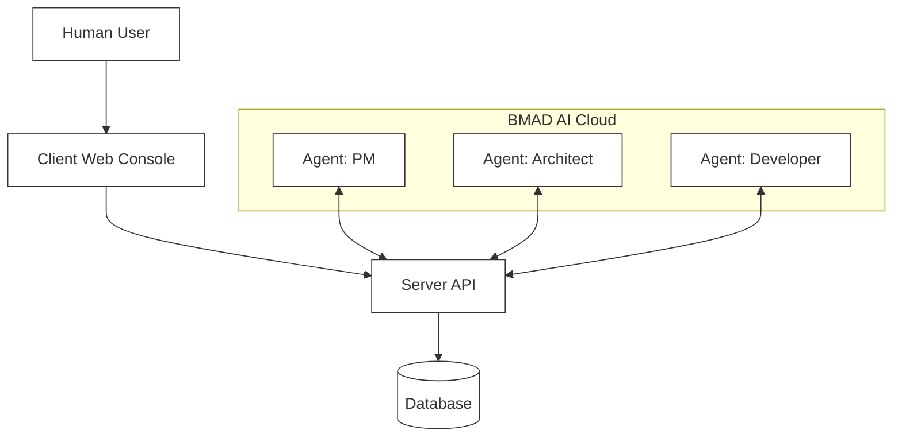

# iTeam 系统架构文档

> iTeam - AI驱动的多设备协作管理系统架构说明

## 📊 系统组件概览

iTeam系统由三个主要组件构成：

1. **client** - Web管理控制台（管理端）
2. **agent-client** - AI Agent桌面客户端（执行端）
3. **server** - 后端服务器（协调中心）

---

## 🌐 client - Web管理控制台

### 基本信息

- **位置**: `/client`
- **技术栈**: React 18 + TypeScript + Vite + Tailwind CSS
- **访问方式**: 浏览器访问 `http://localhost:5173`
- **目标用户**: 👤 人类开发者

### 主要功能

#### 1. 用户认证
- 用户注册和登录
- JWT身份验证
- 受保护的路由

#### 2. Dashboard（仪表盘）📊
- 总体统计数据展示
  - 总设备数
  - 在线设备数
  - 活跃项目数
  - 总提交次数
- 实时在线设备列表
- 系统状态概览

#### 3. 设备管理 🖥️
- 查看所有注册的设备/Agent
- 实时监控设备状态
  - 在线/离线状态
  - 工作中/空闲状态
- 查看设备详细信息
  - CPU使用率
  - 内存使用
  - 角色和技能
  - 操作系统信息
- 设备拓扑图可视化
- 设备HUD（抬头显示）界面

#### 4. 项目管理 📁
- 创建和管理项目
- 查看项目进度
- 代码贡献统计
- 任务分配和跟踪

#### 5. 文档中心 📚
- 知识库管理
- 文档分类
  - 技术标准
  - 技术笔记
  - Bug修复记录
- 全文搜索功能

#### 6. 任务管理
- 创建任务
- 分配任务给特定Agent
- 监控任务执行状态
- 查看任务结果

### 页面路由

```
/                    - Dashboard（仪表盘）
/login              - 登录页面
/register           - 注册页面
/devices            - 设备管理
/projects           - 项目管理
/documents          - 文档中心
/topology           - 设备拓扑图
/device/:id/hud     - 设备HUD界面
```

---

## 🤖 agent-client - AI Agent桌面客户端

### 基本信息

- **位置**: `/agent-client`
- **技术栈**: Electron + Node.js + Socket.io + Claude Code CLI
- **运行方式**: 跨平台桌面应用
- **目标用户**: 🤖 AI Agent（自动化执行）

### 主要功能

#### 1. 服务器连接
- WebSocket实时连接到iTeam服务器
- 设备注册和API Key认证
- 自动心跳保持（每30秒）
- 断线自动重连

#### 2. Agent配置
- 设备名称配置
- 角色选择
  - Frontend Developer
  - Backend Developer
  - Full Stack Developer
  - DevOps Engineer
  - QA Engineer
  - UI/UX Designer
- 技能标签管理（如：react,nodejs,docker）
- 配置本地持久化

#### 3. 任务自动化执行 🎯
- 自动接收服务器分配的任务
- 任务队列管理
- 调用Claude Code CLI执行编程任务
- 支持的任务类型：
  - `code_generation` - 代码生成
  - `code_review` - 代码审查
  - `bug_fix` - Bug修复
  - `test_generation` - 测试生成
  - `refactor` - 代码重构
  - `custom` - 自定义任务

#### 4. 实时监控
- 任务执行状态显示
- 实时日志终端输出
- 任务队列统计
- 完成任务计数

#### 5. 状态同步
- 向服务器报告设备状态（空闲/工作中）
- 上传任务执行结果
- 同步硬件信息
- 发送心跳包

### 技术架构

```
agent-client/
├── src/
│   ├── main/              # Electron主进程
│   │   └── main.js        # 窗口管理、任务队列、IPC处理
│   ├── renderer/          # 渲染进程（UI）
│   │   ├── index.html     # 界面结构
│   │   ├── styles.css     # 样式（暗色主题）
│   │   └── renderer.js    # UI逻辑
│   ├── preload/           # 预加载脚本
│   │   └── preload.js     # 安全的IPC桥梁
│   └── services/          # 服务层
│       ├── socket-service.js   # WebSocket通信
│       └── claude-service.js   # Claude Code CLI调用
```

---

## 🔧 server - 后端服务器

### 基本信息

- **位置**: `/server`
- **技术栈**: Node.js + Express + TypeScript + Prisma + Socket.io
- **运行方式**: 后端服务
- **端口**: 3000

### 核心职责

#### 1. 数据管理 🗄️
- **用户管理**
  - 用户注册和登录
  - JWT Token生成和验证
  - 密码bcrypt加密
  - 用户信息管理

- **设备管理**
  - 设备注册和注销
  - 设备信息存储（名称、类型、角色、技能）
  - 设备状态追踪（online/offline/idle/working）
  - 硬件信息记录

- **项目管理**
  - 项目创建、更新、删除
  - 项目状态管理（active/paused/completed）
  - Git仓库关联

- **任务管理**
  - 任务创建和分配
  - 任务状态追踪
  - 任务执行历史

- **贡献统计**
  - 代码提交次数
  - 代码行数统计（新增/删除）
  - 设备贡献度计算

- **文档管理**
  - 知识库存储
  - 文档分类（标准/技术/Bug修复）
  - 标签和搜索

#### 2. 认证授权 🔐
- **JWT认证** - Web用户使用
  ```
  Authorization: Bearer <token>
  ```

- **API Key认证** - Agent设备使用
  ```
  X-API-Key: iteam-device-key
  ```

#### 3. 实时通信 📡
- **WebSocket服务器** (Socket.io)
  - 设备注册和连接管理
  - 实时状态广播
  - 任务分配推送
  - 心跳检测和维护

- **支持的WebSocket事件**:
  - `device:register` - 设备注册
  - `device:status` - 状态更新
  - `task:update` - 任务更新
  - `task:assigned` - 任务分配
  - `ping/pong` - 心跳

#### 4. 数据统计 📊
- 系统总体统计（设备数、项目数、提交数等）
- 各设备贡献统计
- 各项目进度统计
- 实时数据聚合

#### 5. 自动化任务 ⚙️
- **设备状态监控**
  - 每60秒检查设备活跃度
  - 自动标记5分钟无响应的设备为离线

- **角色文档同步**
  - 启动时自动同步角色技能文档到文档中心

### REST API端点

```
认证相关 (/api/auth)
├── POST /register          # 用户注册
├── POST /login             # 用户登录
└── GET  /me               # 获取当前用户信息

设备管理 (/api/devices) - 需要JWT或API Key
├── GET    /               # 获取所有设备
├── GET    /:id            # 获取设备详情
├── POST   /               # 注册新设备
├── PUT    /:id            # 更新设备信息
└── DELETE /:id            # 删除设备

项目管理 (/api/projects) - 需要JWT
├── GET    /               # 获取所有项目
├── GET    /:id            # 获取项目详情
├── POST   /               # 创建新项目
├── PUT    /:id            # 更新项目
└── DELETE /:id            # 删除项目

文档管理 (/api/documents) - 需要JWT
├── GET    /               # 获取所有文档
├── GET    /:id            # 获取文档详情
├── POST   /               # 创建新文档
├── PUT    /:id            # 更新文档
└── DELETE /:id            # 删除文档

统计数据 (/api/stats) - 需要JWT
├── GET /                  # 系统总体统计
├── GET /devices           # 各设备统计
└── GET /projects          # 各项目统计

角色管理 (/api/roles)
└── GET /                  # 获取所有角色

健康检查 (/api/health)
└── GET /                  # 服务器健康检查
```

### 数据库模型

```
User (用户)
├── id, email, username, password
├── avatar, role
└── createdAt, updatedAt

Device (设备/Agent)
├── id, name, type, role, skills
├── status, os, ip
├── currentProject, currentModule
└── lastSeen, createdAt, updatedAt

Project (项目)
├── id, name, description, repository
├── status, startDate, endDate
└── createdAt, updatedAt

Task (任务)
├── id, deviceId, projectId
├── module, description, status
└── createdAt, updatedAt

Contribution (贡献)
├── id, deviceId, projectId
├── commits, linesAdded, linesDeleted
└── createdAt, updatedAt

Document (文档)
├── id, title, content
├── category, tags, author
└── createdAt, updatedAt
```

### 技术架构

```
server/
├── src/
│   ├── index.ts           # 应用入口
│   ├── routes/            # API路由
│   │   ├── auth.ts        # 认证
│   │   ├── devices.ts     # 设备
│   │   ├── projects.ts    # 项目
│   │   ├── documents.ts   # 文档
│   │   ├── stats.ts       # 统计
│   │   └── roles.ts       # 角色
│   ├── websocket/         # WebSocket
│   │   └── index.ts       # Socket处理
│   ├── middleware/        # 中间件
│   │   └── auth.ts        # JWT验证
│   └── utils/             # 工具
│       ├── logger.ts      # 日志
│       └── syncRoleDocs.ts # 角色文档同步
└── prisma/
    ├── schema.prisma      # 数据模型
    └── dev.db            # SQLite数据库
```

### 关键特性

- ✅ **双重认证机制** - JWT (用户) + API Key (设备)
- ✅ **实时双向通信** - WebSocket支持
- ✅ **自动状态监控** - 定期清理离线设备
- ✅ **数据持久化** - Prisma ORM + SQLite/PostgreSQL
- ✅ **日志系统** - Winston结构化日志
- ✅ **安全加密** - bcrypt密码加密
- ✅ **CORS保护** - 跨域请求限制
- ✅ **优雅关闭** - SIGTERM/SIGINT处理

### 6. BMAD Framework (AI-Driven Development) 🧠
- **Agent Templates**: Standardized roles (PM, Architect, Dev, QA) with specific personas and capabilities.
- **Workflow Engine**: Structured, multi-step task execution (e.g., "Create PRD", "Sprint Planning").
- **Team Orchestration**: Multi-agent collaboration modes (Sequential, Hierarchical, Joint).
- **Task Tracing**: Detailed execution logs for debugging and auditing AI behaviors.

---

## 🔄 System Workflow

### Overall Architecture



### Typical Workflow Example

#### Scenario: "Create a Login Component"

**Step 1: In Client (Web Interface)**
1. Developer logs in.
2. Selects "Create Task" -> "Frontend Feature".
3. Assigns to "Frontend Squad" (Team).

**Step 2: On Server (Orchestration)**
1. Server receives request.
2. Identifies the "Frontend Squad" configuration.
3. Instantiates the "Feature Implementation" workflow.
4. Assigns step 1 (Design) to `ux-agent`.

**Step 3: On Agent (Execution)**
1. `ux-agent` receives task via WebSocket.
2. Executes "Design Component" workflow step.
3. Submits design artifacts back to Server.
4. Server triggers step 2 (Implementation) for `dev-agent`.

---

## 📋 Component Comparison

| Feature | Client (Web) | Agent-Client (Desktop) | Server (Backend) |
|---------|-------------|----------------------|------------------|
| **Role** | Command Center | Worker Node | Orchestrator |
| **User** | 👤 Human | 🤖 AI Agent | - |
| **Tech** | React + Vite | Electron | Node.js + Express |
| **Comms** | HTTP + WS | WebSocket | HTTP + WS |
| **Primary**| Management | Execution | Coordination |

---

## 🔌 Communication Protocols

### HTTP REST API
Standard CRUD operations for data entities.

```
/api/agents             - Agent Template Management
/api/workflows          - Workflow Definition Management
/api/teams              - Team Configuration
/api/traces             - Execution Trace Retrieval
```

### WebSocket Events
Real-time coordination.

**Server → Agent:**
- `workflow:start`: Trigger a new workflow.
- `step:assign`: Assign a specific step to an agent.
- `team:sync`: Synchronize team state.

**Agent → Server:**
- `step:complete`: Notify step completion with artifacts.
- `trace:log`: Send execution logs (thinking process, tool usage).
- `error:report`: Report execution failures.

---

## 💡 Design Philosophy

### The "One-Person Team"
iTeam empowers a single developer to act as a CTO, managing a team of specialized AI agents.

### BMAD-METHOD Integration
We follow the **Breakthrough Method for Agile Development**:
1. **Defined Roles**: Agents aren't generic; they are specialists (PM, QA, Dev).
2. **Structured Flows**: Work isn't random; it follows best-practice workflows.
3. **Traceability**: Every AI decision is logged and auditable.

---

## 🚀 Quick Start

### Start Full System

```bash
# 1. Start Server
cd server
npm run dev

# 2. Start Client
cd client
npm run dev

# 3. Start Agent Client
cd agent-client
npm start
```

### Access Points
- Web Console: `http://localhost:5173`
- Server API: `http://localhost:3000`
- Agent Client: Desktop Application

---

## 📚 Documentation
- [README](./README.md)
- [Server Documentation](./server/README.md)
- [Agent Client Documentation](./agent-client/README.md)
- [BMAD Architecture](./docs/features/BMAD-ARCHITECTURE.md) (New!)

---

**Version**: 0.2.0 (Beta)
**Last Updated**: 2026-02-08
**Maintainer**: iTeam Team
