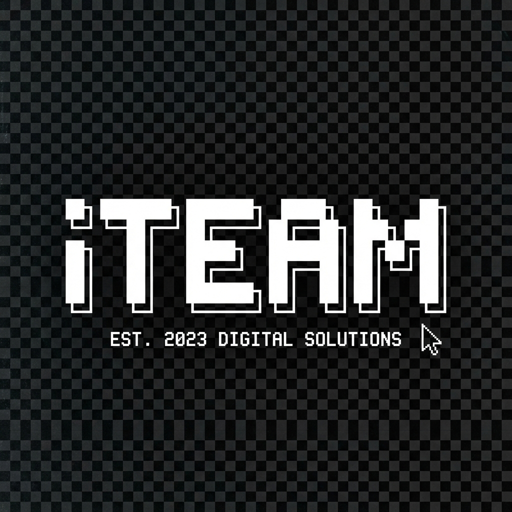
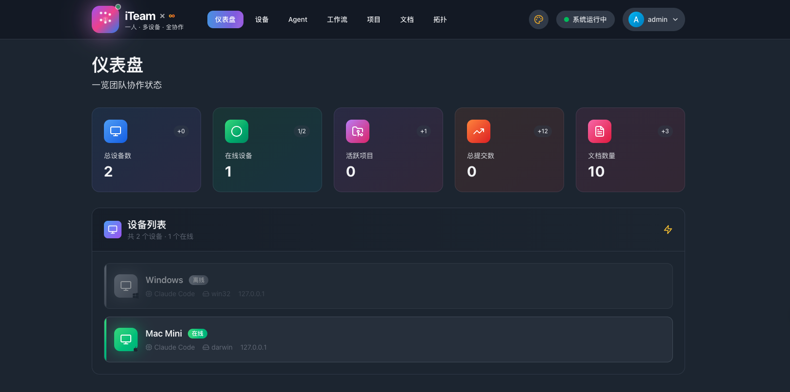
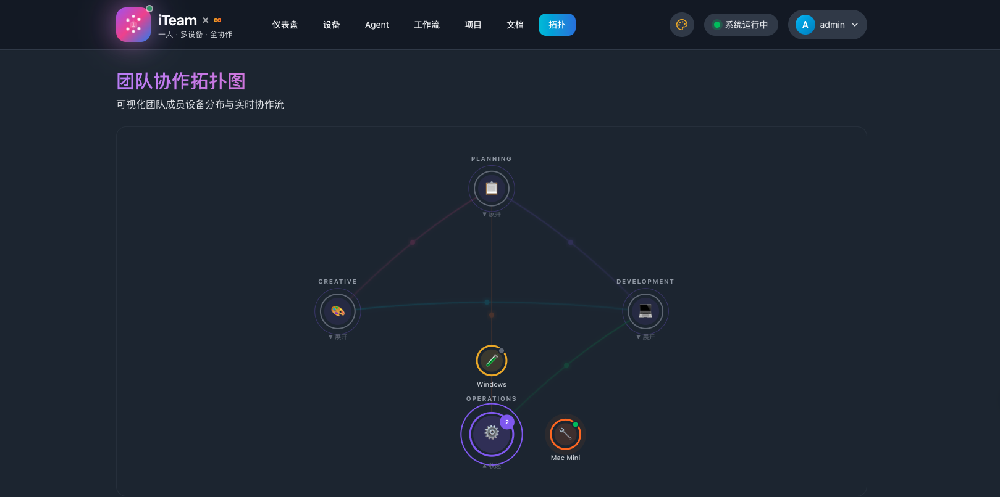

<p align="center">
  
</p>

<p align="center">
  <strong>One Person, One Team · Empower solo developers with team-level capabilities</strong>
</p>

<p align="center">
  <a href="https://github.com/ULis3h/iteam/releases"></a>
  
  
  <a href="https://deepwiki.com/ULis3h/iteam"></a>
</p>

<p align="center">
  <a href="#-quick-start">Quick Start</a> •
  <a href="#-features">Features</a> •
  <a href="#-agent-client">Agent Client</a> •
  <a href="#-tech-stack">Tech Stack</a> •
  <a href="#-documentation">Docs</a> •
  <a href="./README_CN.md">中文文档</a>
</p>

---

<p align="center">
  
</p>

## 🎯 Core Concept

**iTeam** enables solo developers to coordinate multiple AI Agents and development devices like managing a full team.

- 🛡️ **BMAD Integration** - Standardized Agent Roles and Workflows
- 🖥️ **Multi-device Collaboration** - Manage multiple devices as virtual team members
- 🤖 **AI Agent Integration** - Deep integration with Claude Code, Gemini CLI, and more
- 📊 **Real-time Topology** - Visualize connections and status of all devices and agents
- 📝 **Knowledge Base** - Centralized management for docs, tech notes, and bug fixes

---

## ⚡ Quick Start

```bash
# Clone the repository
git clone https://github.com/ULis3h/iteam.git
cd iteam

# Start development environment
./start-dev.sh
```

Visit http://localhost:5173 to get started!

### Download Agent Client

<p>
  <a href="https://github.com/ULis3h/iteam/releases/latest">
    
  </a>
</p>

---

## ✨ Features

### 📡 Device Topology
Click to expand and view device details for each department, with real-time connection monitoring.



### 🤖 AI Agent Client
Standalone desktop app that auto-receives tasks and executes via Claude Code.

### 📋 Project Management
Kanban-style task management with multi-project support.

### 📝 Document Center
Markdown editor with categorized documentation management.

---

## 🤖 Agent Client

Agent Client is iTeam's desktop application that turns your dev machine into a smart agent:

```bash
# Install dependencies
cd agent-client && npm install

# Start the agent
./start-agent.sh
```

**Key Features:**
- ✅ Auto-connect to iTeam server
- ✅ Receive and execute dispatched tasks
- ✅ Invoke Claude Code for automated development
- ✅ Real-time task status reporting

See [Agent Client Documentation](./agent-client/README.md) for details.

---

## 🛠 Tech Stack

| Layer | Technology |
|-------|------------|
| **Frontend** | React 18, TypeScript, Tailwind CSS, Vite |
| **Backend** | Node.js, Express, Prisma ORM, Socket.IO |
| **Database** | SQLite (Dev) / PostgreSQL (Prod) |
| **Desktop** | Electron |
| **AI Integration** | Claude Code, Gemini CLI support |

---

## 📖 Documentation

- 📘 [System Architecture](./ARCHITECTURE.md) - Complete architecture design
- 🧠 [BMAD Architecture](./docs/features/BMAD-ARCHITECTURE.md) - **New!** AI-driven development framework guide
- 📗 [Quick Start Guide](./QUICKSTART.md) - Get started in 5 minutes
- 📙 [Agent Client](./agent-client/README.md) - Desktop client usage
- 📕 [API Reference](./docs/api/README.md) - REST API documentation
- 🇨🇳 [中文文档](./README_CN.md) - Chinese documentation

---

## 🗺 Roadmap

- [x] Device management with real-time status monitoring
- [x] Topology visualization (click to expand/collapse)
- [x] Agent Client desktop application
- [x] Document editor
- [ ] Workflow automation
- [ ] Multi-agent collaborative tasks
- [ ] Code contribution analytics

---

## 📝 License

MIT License © 2024 [ULis3h](https://github.com/ULis3h)

---

<p align="center">
  <strong>iTeam</strong> - Give one person the power of an entire team 💪
</p>
