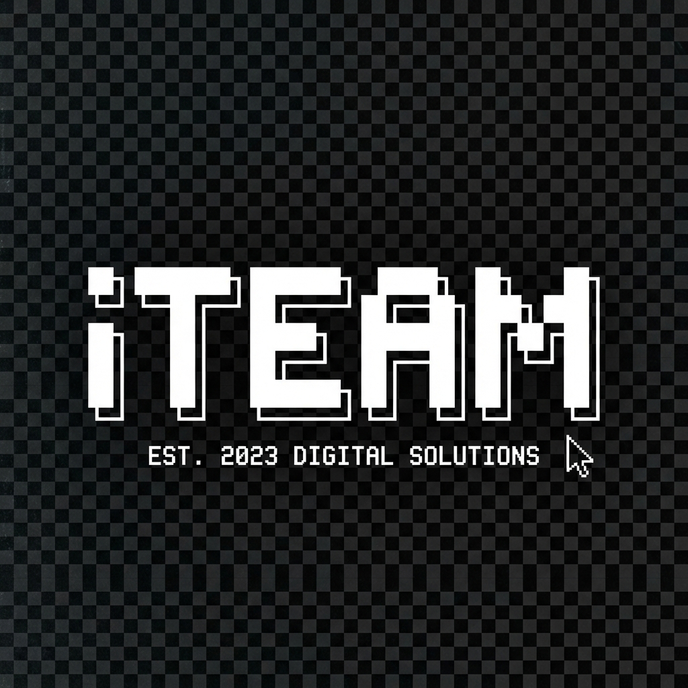

<p align="center">
  
</p>

<p align="center">
  <strong>Orchestrate local and remote coding agents into automated pipelines.</strong><br>
  Claude Code · Codex CLI · Gemini CLI · any command-line agent
</p>

<p align="center">
  <a href="./README_CN.md">中文文档</a> ·
  <a href="./docs/quickstart.md">Quick start</a> ·
  <a href="./docs/concepts.md">Concepts</a> ·
  <a href="./docs/workflow-format.md">Workflow format</a> ·
  <a href="./docs/runner.md">Remote runners</a> ·
  <a href="./docs/api.md">API</a>
</p>

---

## What it does

iTeam turns the agent CLIs you already have into a team. You define **agents** (a role + a CLI runtime with its own model and reasoning effort, running locally or on a remote machine), compose them into a **workflow** (steps with dependencies), and **run** it. Independent steps execute in parallel, each step can use the output of the steps before it, and you watch everything happen in one place: the pipeline graph, the roadmap, and the live logs.

| | |
|---|---|
| **Agents** | Claude Code, Codex CLI, Gemini CLI, or a custom command. Per-agent model, effort (`low / medium / high / max`), role instructions, working directory, timeout. |
| **Local or remote** | Local agents run on the server. Remote agents run on any machine that starts the lightweight runner. |
| **Workflows** | Steps form a DAG. `{{inputs.x}}` and `{{steps.id.output}}` pass data between steps. Per-step model/effort override, retries, timeout, continue-on-error. |
| **Runs** | Pipeline view, stage roadmap + timeline, live per-step logs, rendered prompt and output, cancel, retry failed steps, run again. |
| **Import / export** | Workflows are plain YAML or JSON files. Import from the UI (agents are created from the file), export any workflow. |
| **Quick task** | One prompt on one agent, no workflow needed. |

## Quick start

Requirements: Node.js 20+, and at least one agent CLI installed and logged in (`claude`, `codex`, or `gemini`).

```bash
git clone https://github.com/ULis3h/iteam.git
cd iteam
npm install
npm run dev
```

Open <http://localhost:5173>.

1. **Agents → New agent** — name it, pick the CLI, model and effort.
2. **Workflows → Import** — paste [`examples/feature-development.yaml`](./examples/feature-development.yaml) (or build one in the editor).
3. **Run** — fill in the inputs and watch the pipeline.

Single-port production mode: `npm run build && npm start` serves the UI and API on port 3000.

## A workflow file

```yaml
name: Bug fix
inputs:
  - key: repo
    required: true
  - key: bug
    required: true
agents:
  - name: Investigator
    provider: claude-code
    model: sonnet
    effort: high
  - name: Fixer
    provider: codex
    model: gpt-5-codex
    effort: medium
steps:
  - id: reproduce
    name: Reproduce
    agent: Investigator
    prompt: "Repo {{inputs.repo}}. Bug: {{inputs.bug}}. Find the root cause and add a failing test."
  - id: fix
    name: Fix
    agent: Fixer
    dependsOn: [reproduce]
    retries: 1
    prompt: "Repo {{inputs.repo}}. Fix the issue described here and make the test pass:\n{{steps.reproduce.output}}"
```

More in [`examples/`](./examples). Full reference: [docs/workflow-format.md](./docs/workflow-format.md).

## Remote machines

```bash
cd runner && npm install
node bin/iteam-runner.js --server http://SERVER:3000 --token <ITEAM_TOKEN> --name my-mac
```

The machine appears under **Agents → Runners**; create an agent with location *remote* and pick it. See [docs/runner.md](./docs/runner.md).

## Project layout

```
server/   Express + Prisma (SQLite) + Socket.IO — API, scheduler, executors
client/   React + Vite + Tailwind — the web UI
runner/   Node CLI — executes steps on remote machines
docs/     Documentation
examples/ Importable workflow files
```

## License

MIT © [ULis3h](https://github.com/ULis3h)
