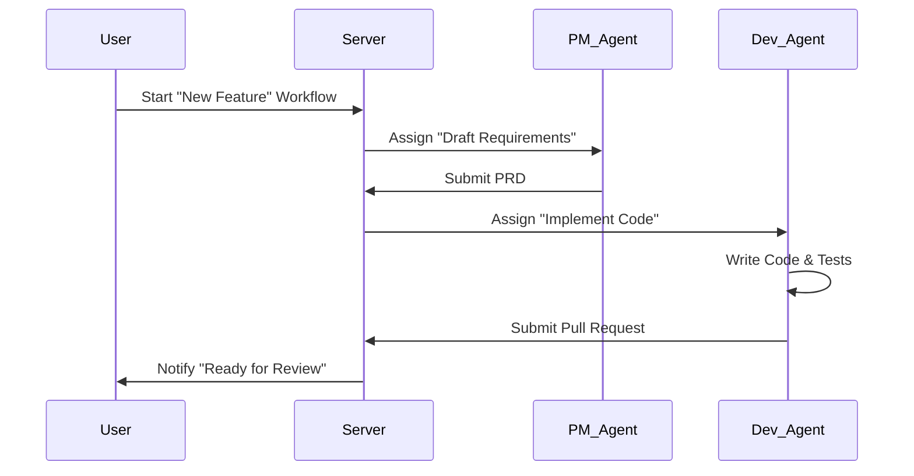

# BMAD Architecture Integration

> **BMAD** (Breakthrough Method for Agile Development) is an AI-native development methodology that structures the collaboration between human developers and AI agents.

## 1. Core Concepts

### 1.1 Agent Templates (Roles)
Instead of generic "AI Assistants", iTeam uses specialized **Agent Artifacts** defined by YAML templates.

- **Product Manager (PM)**: Focuses on requirements, user stories, and PRDs.
- **Architect**: Focuses on system design, database schemas, and API definitions.
- **Developer**: Focuses on implementation, code quality, and bug fixing.
- **QA Engineer**: Focuses on test strategies and validation.

### 1.2 Workflows
Structured sequences of tasks that guide Agents through complex processes.

- **Quick Flow**: `[Spec] -> [Code] -> [Review]` (for small tasks)
- **Full Flow**: `[Research] -> [Plan] -> [Design] -> [Implement] -> [Verify]` (for features)

### 1.3 Team Orchestration
Organizes Agents into collaboration modes:
- **Sequential**: Token passing (Agent A finishes -> Agent B starts).
- **Hierarchical**: Manager agent delegates to worker agents.
- **Joint**: Multiple agents working on shared context (via shared workspace/repo).

---

## 2. Technical Implementation

### 2.1 Database Schema
The Prisma schema has been extended to support BMAD entities:

- `AgentTemplate`: Defines the capabilities and persona of an agent.
- `Workflow`: Defines the steps and logic of a standard process.
- `Team`: Defines a group of agents and their collaboration mode.
- `TraceEntry`: Logs detailed execution steps for observability.

### 2.2 Server Architecture
The Node.js/Express server acts as the **Orchestrator**:

1. **Workflow Engine**: Resolves a workflow definition into executable steps.
2. **Dispatcher**: Assigns steps to connected Agents based on their Role/Capabilities.
3. **Context Manager**: Maintains shared context (files, git state) across the team.

### 2.3 Agent Client
The Electron-based client acts as the **Runtime**:

1. **Tool Usage**: Agents use `Claude Code` or custom scripts to execute steps.
2. **Protocol**: Communicates via WebSocket (`workflow:step`, `tool:use`, `trace:log`).

---

## 3. Workflow Example: "Feature Implementation"

## 4. Tracing & Observability
Every action taken by an Agent is logged as a `TraceEntry`.

- **Input**: What prompted the agent.
- **Thought**: The reasoning process (Chain of Thought).
- **Action**: Tool execution (file read, command run).
- **Result**: Output of the action.

This allows full replayability of the development session.
